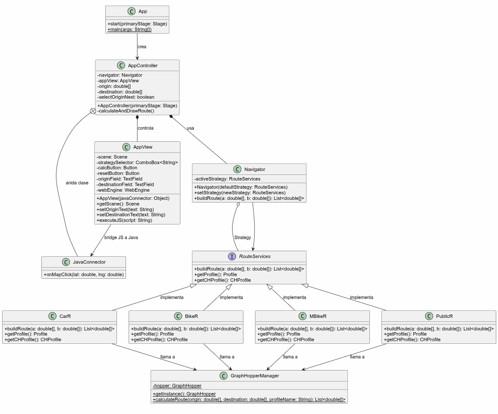

# Maps_de_temu

Esta aplicación es un navegador y calculador de rutas interactivo construido con JavaFX y GraphHopper. Su función es permitirte hacer clic en un mapa (mostrado mediante un visor web basado en Leaflet) para elegir un punto de origen y un punto de destino, calculando la ruta óptima para diferentes medios de transporte (Carro, Moto, Bicicleta, a pie).

## Configuración del Mapa (.pbf)

Para que el enrutamiento funcione sin conexión a internet, necesitas proveer la información cartográfica de OpenStreetMap de manera local.

1. **Descargar Archivo:** Descarga el archivo de mapa para Colombia en formato `.pbf` desde: [https://download.geofabrik.de/south-america/colombia.html](https://download.geofabrik.de/south-america/colombia.html) (ej: `colombia-latest.osm.pbf`).
2. **Ubicación:** Renombra el archivo a `mapacolombia.pbf` e inclúyelo en la carpeta de recursos de tu proyecto: `demo/src/main/resources/mapacolombia.pbf` (o `demo/target/classes/mapacolombia.pbf`).
3. **Carga Interna:** Cuando la aplicación inicia, la clase `GraphHopperManager` instanciará GraphHopper en segundo plano, y buscará este archivo mapeándolo y transformándolo en un grafo en caché, quedando lista para graficar las rutas al hacer clic.

## UML

A continuación se muestra el esquema arquitectónico completo de nuestro sistema:

- Juan Daniel Palomino García 20232020065
- Juan Camilo Carvajal Camargo 20232020026
- Josep Emmanuel Leon Joya 20231020160